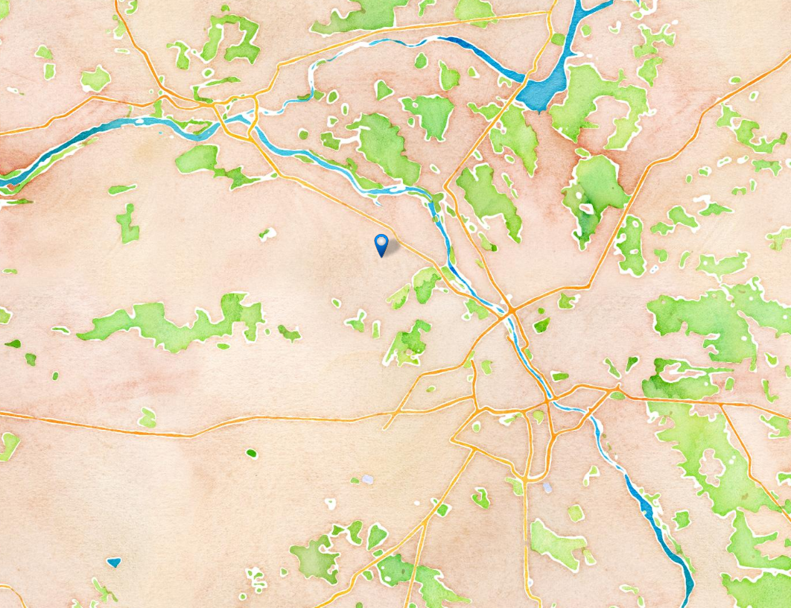

# Ciapucache!

  

Dawno…, dawno…., temu… Puszcza porastająca okolice Białego Miasta była gęsta i mroczna z czasem tak jak nazwa wsi się zmieniła to Puszcza zyskała nazwę (chociaż pochodzenia nazwy nikt nie jest pewien).  
To było pod koniec XV wieku -  budniczy z małej osady Kapinos zaczęli słyszeć głosy „to tu” „to tam” … i bardzo się przestraszyli. Poszli po radę do swojego przywódcy Ciaputy Śmiałego, żeby się dowiedzieć skąd te głosy „to tu”, „to tam” i co one oznaczają…  
A On im powiedział żeby poszli za tymi głosami i powiedzieli mu dokąd te głosy ich prowadzą. Oni poszli – ale nie prowadziły ich w konkretne miejsce tylko „to tu”, „to tam”.  
Więc poszedł ON – i jako jedyny szedł za głosem tak daleko aż ten doprowadził Go na wschodni skraj Puszczy szedł szlakiem skrajem Puszczy w stronę wsi upadłej "Dziekanów" i zobaczył drzewa okorowane jakby ktoś pierścienie chciał im wyrzeźbić w korzem, aż nagle potwór go dopadł z językiem rozdwojonym [jaszczurka zwinka](https://www.inaturalist.org/observations/41560562) i drugi co cały był w kropki [biedroneczka](https://www.inaturalist.org/observations/41560568). Piasek utrudniał, ale ON dzielnie walczył i wbiegł na małą górkę i wygrał!  

[Gorka](./Pics/2020-04-06T16:01:54_1.JPG)  

Był ranny i schronił sie w szałasie z gałęzi gdzie odpoczął.  

pic szalas

"To tu to tam" poprowadziło go do leżącego pnia koło szałasu  

pic log

i już, już miał ten pień odsunąć kiedy zazdrosny Rywal (zwany „Rywalem Zazdrosnym”) rzucił się na niego z mieczem.  
A wtedy burza się rozpętała i trzęsienie ziemi i powódź i zaćmienie słońca i 7 plag Egipskich oraz  wielki pożar ogarnął Puszczę.  
No i nie zobaczył Ciaputa Śmiały co było pod pniem, aaa…. Był tam skarb.  

I kiedy przy tym pniu odwrócisz się do tyłu były jeszcze dwa skarby  
„to tu”  

[Zosia_Before](./Pics/2020-04-06T15:24:58_1.JPG)  

[Zosia_After](./Pics/2020-04-06T15:25:40_1.JPG)  

„to tam”.   

[Rodznia](./Pics/2020-04-06T15:27:10_1.JPG)  

i kolejne... looking to the west in standing dead birch with Polyporus... there is log resting laying and hiding something underneath  

[Piotrek](./Pics/2020-04-06T15:32:58_1.JPG)  
[Piotrek](./Pics/2020-04-06T15:32:42_1.JPG)  

Indic FR

[Kubus_far](./Pics/2020-04-06T15:48:06_1.JPG)  
[Kubus_close](./Pics/2020-04-06T15:42:40_1.JPG)  

Jak głosi Legenda tylko potomkowie Ciaputy Śmiałego (i jego  Żona – też Rodzina) mogą odnaleźć to co dla nich zachowała Puszcza…
A gdzie…?  „TO TU”, „TO TAM” 
podążaj za wskazówkami..... 

:sparkles: for nice decorations  
:metal:  

:octocat:  

